# Animation Catalog

All animations in the MouseHouse (CrabbyCS) app, organized by category. Each sprite sheet PNG has been converted to an animated GIF for Aseprite editing. Both formats live side-by-side in the assets directory.

---

## Mouse Pet Animations

The main desktop pet. Three color modes: default (2-color), 1-color (`_1c_`), and full-color (`_fc_`). Sprites are 76x76px per frame.

### Walk (8 frames @ 250ms)

| Default | 1-Color | Full-Color |
|---------|---------|------------|
|  | 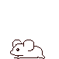 | 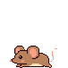 |

`assets/sprites/pets/mouse_walk.png` / `mouse_1c_walk.png` / `mouse_fc_walk.png`

Pink nose variant: 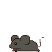
`assets/sprites/pets/mouse_walk_pinknose.png`

### Idle (8 frames @ 130ms)

| Default | 1-Color | Full-Color |
|---------|---------|------------|
|  |  |  |

`assets/sprites/pets/mouse_idle.png` / `mouse_1c_idle.png` / `mouse_fc_idle.png`

### Sleep Intro (12 frames @ 130ms)

| Default | 1-Color | Full-Color |
|---------|---------|------------|
|  |  |  |

`assets/sprites/pets/mouse_sleep.png` / `mouse_1c_sleep.png` / `mouse_fc_sleep.png`

### Sleep Loop (3 frames @ 300ms, frame 0 holds 10s in-game)

| Default | 1-Color | Full-Color |
|---------|---------|------------|
| 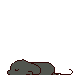 | 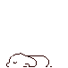 | 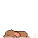 |

`assets/sprites/pets/mouse_sleep_loop.png` / `mouse_1c_sleep_loop.png` / `mouse_fc_sleep_loop.png`

### Jump (8 frames @ 130ms)

| Default | 1-Color | Full-Color |
|---------|---------|------------|
| 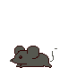 | 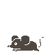 |  |

`assets/sprites/pets/mouse_jump.png` / `mouse_1c_jump.png` / `mouse_fc_jump.png`

Eyes-closed variant: 
`assets/sprites/pets/mouse_jump_eyes_closed.png`

### Backups

| File | Description |
|------|-------------|
|  | `mouse_idle BACKUP.png` — idle backup |
|  | `mouse_walk BACKUP.png` — walk backup |
|  | `mouse_sleep BACKUP.png` — sleep backup |
|  | `mouse_sleep BACKUP v2.png` — sleep backup v2 |
| 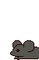 | `mouse_sleep_12frame_backup.png` |
|  | `mouse_sleep_loop_12frame_backup.png` |

### Other Pets

| Pet | Preview | Path |
|-----|---------|------|
| Cat | 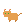 | `assets/sprites/pets/cat.png` |
| Crab |  | `assets/sprites/pets/crab.png` |
| Duck | 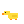 | `assets/sprites/pets/duck.png` |
| Frog | 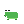 | `assets/sprites/pets/frog.png` |
| Hamster | 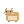 | `assets/sprites/pets/hamster.png` |
| Penguin | 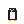 | `assets/sprites/pets/penguin.png` |

Fishing variants also exist: `cat_fishing.png`, `crab_fishing.png`, `duck_fishing.png`, `frog_fishing.png`, `hamster_fishing.png`, `mouse_fishing.png`, `penguin_fishing.png`

---

## Events (150ms per frame)

Random events that fly/walk across the screen. Each has default, 1-color, and 2-color variants in `sprites/events/`, `sprites/events/1color/`, and `sprites/events/2color/`.

### Core Events (registered in EventManager.cs)

| Event | Frames | Preview | Path |
|-------|--------|---------|------|
| Seagull | 8 |  | `sprites/events/seagull.png` |
| Butterfly | 4 |  | `sprites/events/butterfly.png` |
| Falling Leaf | 4 | 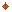 | `sprites/events/falling_leaf.png` |
| Shooting Star | 3 |  | `sprites/events/shooting_star.png` |
| Firefly | 4 | 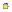 | `sprites/events/firefly.png` |
| Paper Airplane | 4 |  | `sprites/events/paper_airplane.png` |
| Balloon | 2 | 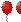 | `sprites/events/balloon.png` |
| Rain Cloud | 6 | 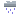 | `sprites/events/rain_cloud.png` |
| Bat | 4 | 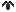 | `sprites/events/bat.png` |
| Ladybug | 4 | 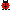 | `sprites/events/ladybug.png` |
| Dragonfly | 4 | 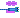 | `sprites/events/dragonfly.png` |
| Jellyfish | 4 | 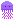 | `sprites/events/jellyfish.png` |
| Dolphin | 6 | 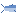 | `sprites/events/dolphin.png` |
| Hot Air Balloon | 2 | 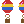 | `sprites/events/hot_air_balloon.png` |
| Comet | 3 |  | `sprites/events/comet.png` |
| Dust Devil | 4 |  | `sprites/events/dust_devil.png` |
| Frog | 4 | 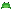 | `sprites/events/frog.png` |
| Hermit Crab | 4 | 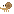 | `sprites/events/hermit_crab.png` |
| Pelican | 4 |  | `sprites/events/pelican.png` |
| Crab Ghost | 4 | 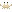 | `sprites/events/crab_ghost.png` |

### Additional Events (auto-detected)

| Event | Preview | Path |
|-------|---------|------|
| Ant Line |  | `sprites/events/ant_line.png` |
| Aurora | 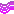 | `sprites/events/aurora.png` |
| Beach Ball |  | `sprites/events/beach_ball.png` |
| Cherry Blossoms |  | `sprites/events/cherry_blossoms.png` |
| Coconut | 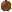 | `sprites/events/coconut.png` |
| Dandelion Stem | 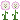 | `sprites/events/dandelion_stem.png` |
| Meteor Shower | 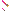 | `sprites/events/meteor_shower.png` |
| Owl | 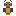 | `sprites/events/owl.png` |
| Pelican Dive | 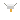 | `sprites/events/pelican_dive.png` |
| Rainbow | 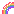 | `sprites/events/rainbow.png` |
| Sand Dollar | 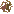 | `sprites/events/sand_dollar.png` |
| Sandcastle | 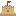 | `sprites/events/sandcastle.png` |
| Sea Foam |  | `sprites/events/sea_foam.png` |
| Sea Turtle | 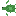 | `sprites/events/sea_turtle.png` |
| Sea Urchin | 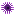 | `sprites/events/sea_urchin.png` |
| Seashell |  | `sprites/events/seashell.png` |
| Snail | 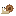 | `sprites/events/snail.png` |
| Snowflakes |  | `sprites/events/snowflakes.png` |
| Soap Bubbles |  | `sprites/events/soap_bubbles.png` |
| Starfish |  | `sprites/events/starfish.png` |
| Treasure Coin |  | `sprites/events/treasure_coin.png` |
| Tumbleweed | 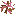 | `sprites/events/tumbleweed.png` |
| UFO | 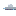 | `sprites/events/ufo.png` |
| Wave |  | `sprites/events/wave.png` |

### Single-Frame Events

These are static or single-image events:

| Event | Preview | Path |
|-------|---------|------|
| Bottle Message |  | `sprites/events/bottle_message.png` |
| Campfire |  | `sprites/events/campfire.png` |
| Crab Hole | 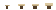 | `sprites/events/crab_hole.png` |
| Dandelion Seeds | 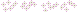 | `sprites/events/dandelion_seeds.png` |
| Fish |  | `sprites/events/fish.png` |
| Fog |  | `sprites/events/fog.png` |
| Lightning | 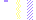 | `sprites/events/lightning.png` |
| Manta Ray | 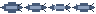 | `sprites/events/manta_ray.png` |
| Message in Bottle | 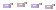 | `sprites/events/message_in_bottle.png` |
| Octopus | 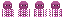 | `sprites/events/octopus.png` |
| Palm Frond | 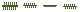 | `sprites/events/palm_frond.png` |
| Pizza Slice | 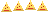 | `sprites/events/pizza_slice.png` |
| Puddle | 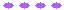 | `sprites/events/puddle.png` |
| Seahorse |  | `sprites/events/seahorse.png` |
| Seaweed |  | `sprites/events/seaweed.png` |
| Sunbeam |  | `sprites/events/sunbeam.png` |
| Tide Pool |  | `sprites/events/tide_pool.png` |
| Whale Spout |  | `sprites/events/whale_spout.png` |

---

## Ambience Sprites

Background atmosphere sprites in `assets/sprites/ambience/`:

| Name | Preview | Path |
|------|---------|------|
| Boat |  | `sprites/ambience/boat.png` |
| Butterfly |  | `sprites/ambience/butterfly.png` |
| Cloud Shadow |  | `sprites/ambience/cloud_shadow.png` |
| Firefly |  | `sprites/ambience/firefly.png` |
| Ghost Crab |  | `sprites/ambience/ghost_crab.png` |
| Hermit Crab |  | `sprites/ambience/hermit_crab.png` |
| Jellyfish |  | `sprites/ambience/jellyfish.png` |
| Man of War |  | `sprites/ambience/man_of_war.png` |
| Night Sparkle |  | `sprites/ambience/night_sparkle.png` |
| Owl |  | `sprites/ambience/owl.png` |
| Pirate Ship |  | `sprites/ambience/pirate_ship.png` |
| Sandpiper |  | `sprites/ambience/sandpiper.png` |
| Seagull |  | `sprites/ambience/seagull.png` |
| Shore Foam |  | `sprites/ambience/shore_foam.png` |
| Sparkle |  | `sprites/ambience/sparkle.png` |
| St. Elmo's Fire |  | `sprites/ambience/st_elmos_fire.png` |
| Starfish |  | `sprites/ambience/starfish.png` |
| Waves |  | `sprites/ambience/waves.png` |

---

## Hats

Equippable hats in `assets/sprites/hats/` (3 frames each for walk animation overlay):

| Hat | Preview | Path |
|-----|---------|------|
| Bunny Ears |  | `sprites/hats/bunny_ears.png` |
| Chef Hat |  | `sprites/hats/chef_hat.png` |
| Crown |  | `sprites/hats/crown.png` |
| Flower Crown |  | `sprites/hats/flower_crown.png` |
| Party Hat |  | `sprites/hats/party_hat.png` |
| Pirate Hat |  | `sprites/hats/pirate_hat.png` |
| Santa Hat |  | `sprites/hats/santa_hat.png` |
| Sunglasses |  | `sprites/hats/sunglasses.png` |
| Top Hat |  | `sprites/hats/top_hat.png` |
| Witch Hat |  | `sprites/hats/witch_hat.png` |
| Wizard Hat |  | `sprites/hats/wizard_hat.png` |
| Hat Icons |  | `sprites/hats/hat_icons.png` |

---

## Eyes

Eye style overlays in `assets/sprites/eyes/` (3 frames each):

| Style | Preview | Path |
|-------|---------|------|
| Normal |  | `sprites/eyes/normal.png` |
| Angry |  | `sprites/eyes/angry.png` |
| Sleepy |  | `sprites/eyes/sleepy.png` |
| Sparkly |  | `sprites/eyes/sparkly.png` |
| Eye Icons |  | `sprites/eyes/eye_icons.png` |

---

## Fishing Overlay

Fish sprites for the fishing mini-game in `assets/sprites/fishing_overlay/` (2 frames each). Also has 1-color and 2-color variants.

| Fish | Preview | Path |
|------|---------|------|
| Bluefish |  | `sprites/fishing_overlay/bluefish.png` |
| Clownfish |  | `sprites/fishing_overlay/clownfish.png` |
| Coelacanth |  | `sprites/fishing_overlay/coelacanth.png` |
| Golden Fish |  | `sprites/fishing_overlay/goldenfish.png` |
| Goldfish |  | `sprites/fishing_overlay/goldfish.png` |
| Green Fish |  | `sprites/fishing_overlay/greenfish.png` |
| Pink Fish |  | `sprites/fishing_overlay/pinkfish.png` |
| Purple Fish |  | `sprites/fishing_overlay/purplefish.png` |
| Red Fish |  | `sprites/fishing_overlay/redfish.png` |
| Teal Fish |  | `sprites/fishing_overlay/tealfish.png` |
| Tropical Fish |  | `sprites/fishing_overlay/tropical_fish.png` |
| Whale |  | `sprites/fishing_overlay/whale.png` |
| Yellow Fish |  | `sprites/fishing_overlay/yellowfish.png` |
| Anglerfish |  | `sprites/fishing_overlay/anglerfish.png` |
| Electric Eel |  | `sprites/fishing_overlay/electric_eel.png` |
| Flying Fish |  | `sprites/fishing_overlay/flying_fish.png` |
| Jellyfish |  | `sprites/fishing_overlay/jellyfish.png` |
| Lobster |  | `sprites/fishing_overlay/lobster.png` |
| Manta Ray |  | `sprites/fishing_overlay/manta_ray.png` |
| Narwhal |  | `sprites/fishing_overlay/narwhal.png` |
| Octopus |  | `sprites/fishing_overlay/octopus.png` |
| Pufferfish |  | `sprites/fishing_overlay/pufferfish.png` |
| Sea Turtle |  | `sprites/fishing_overlay/sea_turtle.png` |
| Seahorse |  | `sprites/fishing_overlay/seahorse.png` |
| Shark |  | `sprites/fishing_overlay/shark.png` |
| Starfish |  | `sprites/fishing_overlay/starfish.png` |
| Swordfish |  | `sprites/fishing_overlay/swordfish.png` |
| Bobber |  | `sprites/fishing_overlay/bobber.png` |

---

## Crab Sprites

Main crab character in `assets/sprites/`:

| Variant | Preview | Path |
|---------|---------|------|
| Default |  | `sprites/crab.png` |
| Black |  | `sprites/crab_black.png` |
| Blue |  | `sprites/crab_blue.png` |
| Golden |  | `sprites/crab_golden.png` |
| Green |  | `sprites/crab_green.png` |
| Orange |  | `sprites/crab_orange.png` |
| Pink |  | `sprites/crab_pink.png` |
| Purple |  | `sprites/crab_purple.png` |
| Red |  | `sprites/crab_red.png` |
| Click |  | `sprites/crab_click.png` |
| Fishing |  | `sprites/crab_fishing.png` |
| Sleep |  | `sprites/crab_sleep.png` |
| Portrait |  | `crab_portrait.png` |

---

## Activities

### Dance (`assets/dance/`)

| Name | Preview | Path |
|------|---------|------|
| Background |  | `dance/dance_bg.png` |
| Crab Pose 0 |  | `dance/dance_crab_0.png` |
| Crab Pose 1 |  | `dance/dance_crab_1.png` |
| Crab Pose 2 |  | `dance/dance_crab_2.png` |
| Crab Pose 3 |  | `dance/dance_crab_3.png` |
| Mouse Pose 0 |  | `dance/dance_mouse_0.png` |
| Mouse Pose 1 |  | `dance/dance_mouse_1.png` |
| Mouse Pose 2 |  | `dance/dance_mouse_2.png` |
| Mouse Pose 3 |  | `dance/dance_mouse_3.png` |
| Stumble |  | `dance/dance_stumble.png` |
| Note (Blue) |  | `dance/note_blue.png` |
| Note (Green) |  | `dance/note_green.png` |
| Note (Red) |  | `dance/note_red.png` |
| Note (Yellow) |  | `dance/note_yellow.png` |
| Pad (Blue) |  | `dance/pad_blue.png` |
| Pad (Green) |  | `dance/pad_green.png` |
| Pad (Red) |  | `dance/pad_red.png` |
| Pad (Yellow) |  | `dance/pad_yellow.png` |

### Gardening (`assets/gardening/`)

Plants have growth stages (0, 1, 2) and a harvest sprite.

| Plant | Stage 0 | Stage 1 | Stage 2 | Harvest |
|-------|---------|---------|---------|---------|
| Acorn |  |  |  |  |
| Berry |  |  |  |  |
| Clover |  |  |  |  |
| Dandelion |  |  |  |  |
| Mushroom |  |  |  |  |
| Sunflower |  |  |  |  |

Other:  `garden_bg.png`,  `butterfly.png`,  `ladybug.png`,  `watering_can_cursor.png`

### Stargazing (`assets/stargazing/`)

| Name | Preview | Path |
|------|---------|------|
| Background |  | `stargazing/stargazing_bg.png` |
| Star |  | `stargazing/star.png` |
| Star Bright |  | `stargazing/star_bright.png` |
| Shooting Star |  | `stargazing/shooting_star.png` |

### Paint (`assets/paint/`)

Tool icons and UI elements for the paint activity.

| Name | Preview | Path |
|------|---------|------|
| Titlebar |  | `paint/titlebar.png` |
| Pencil |  | `paint/tool_pencil.png` |
| Brush |  | `paint/tool_brush.png` |
| Eraser |  | `paint/tool_eraser.png` |
| Fill |  | `paint/tool_fill.png` |
| Line |  | `paint/tool_line.png` |
| Rectangle |  | `paint/tool_rect.png` |
| Circle |  | `paint/tool_circle.png` |
| Eyedropper |  | `paint/tool_eyedropper.png` |
| Text |  | `paint/tool_text.png` |
| Zoom |  | `paint/tool_zoom.png` |

Each tool also has a `_pressed` variant. Patterns: `pat_solid`, `pat_light`, `pat_heavy`, `pat_horz`, `pat_vert`, `pat_dots`, `pat_cross`, `pat_checker` (each with `_pressed` variant).

### Kite Flying (`assets/kite/`)

| Name | Preview | Path |
|------|---------|------|
| Background |  | `kite/kite_bg.png` |
| Cloud 0 |  | `kite/cloud_0.png` |
| Cloud 1 |  | `kite/cloud_1.png` |
| Cloud 2 |  | `kite/cloud_2.png` |
| Leaf |  | `kite/leaf.png` |
| Raindrop |  | `kite/raindrop.png` |

### Farm (`assets/farm/`)

Underwater farm crops with 4 growth stages (0-3):

| Crop | Stage 0 | Stage 1 | Stage 2 | Stage 3 |
|------|---------|---------|---------|---------|
| Barnacle |  |  |  |  |
| Coral |  |  |  |  |
| Kelp |  |  |  |  |
| Pearl Oyster |  |  |  |  |
| Sand Dollar |  |  |  |  |
| Sea Cucumber |  |  |  |  |
| Sea Grapes |  |  |  |  |
| Sea Pineapple |  |  |  |  |

Other:  `farm_bg.png`,  `shell_icon.png`,  `sparkle.png`,  `water_drop.png`

---

## House / Crab Den (`assets/house/`)

Tile and decoration sprites for the crab's underground home.

**Tiles:** `sand_0-3.png`, `dirt_0-3.png`, `wood_0-3.png`, `hollow_0-2.png`, `air_0-2.png`

**Decorations:**

| Name | Preview | Path |
|------|---------|------|
| Coral |  | `house/deco_coral.png` |
| Driftwood |  | `house/deco_driftwood.png` |
| Flag |  | `house/deco_flag.png` |
| Kelp Curtain |  | `house/deco_kelp_curtain.png` |
| Pebble |  | `house/deco_pebble.png` |
| Porthole |  | `house/deco_porthole.png` |
| Seaweed |  | `house/deco_seaweed.png` |
| Shelf |  | `house/deco_shelf.png` |
| Shell Sconce |  | `house/deco_shell_sconce.png` |
| Dig Particles |  | `house/dig_particles.png` |

**Icons:** `icon_back.png`, `icon_decorate.png`, `icon_fill.png`, `icon_offline.png`, `icon_online.png`, `icon_shovel.png`

---

## Zone Props (`assets/sprites/zones/props/`)

Furniture and scenery for different zones:

| Prop | Preview | Path |
|------|---------|------|
| Beach Chair |  | `sprites/zones/props/beach_chair.png` |
| Beach Towel |  | `sprites/zones/props/beach_towel.png` |
| Beach Umbrella |  | `sprites/zones/props/beach_umbrella.png` |
| Bed |  | `sprites/zones/props/bed.png` |
| Bookshelf |  | `sprites/zones/props/bookshelf.png` |
| Bucket & Shovel |  | `sprites/zones/props/bucket_shovel.png` |
| Campfire |  | `sprites/zones/props/campfire.png` |
| Coffee Table |  | `sprites/zones/props/coffee_table.png` |
| Couch |  | `sprites/zones/props/couch.png` |
| Floor Lamp |  | `sprites/zones/props/floor_lamp.png` |
| Lantern |  | `sprites/zones/props/lantern.png` |
| Log |  | `sprites/zones/props/log.png` |
| Ocean Waves |  | `sprites/zones/props/ocean_waves.png` |
| Tent |  | `sprites/zones/props/tent.png` |
| Tree |  | `sprites/zones/props/tree.png` |

---

## UI Elements (`assets/ui/`)

Menu and HUD icons:

| Name | Preview | Path |
|------|---------|------|
| Clock |  | `ui/clock.png` |
| Cookbook |  | `ui/cookbook.png` |
| Farm Tools |  | `ui/farm_tools.png` |
| Fishing Rod |  | `ui/fishing_rod.png` |
| Gear |  | `ui/gear.png` |
| Music Box |  | `ui/music_box.png` |
| Paint Set |  | `ui/paint_set.png` |
| Playing Cards |  | `ui/playing_cards.png` |
| Seed Packet |  | `ui/seed_packet.png` |
| Telescope |  | `ui/telescope.png` |
| Sound On |  | `ui/sound_on.png` |
| Sound Off |  | `ui/sound_off.png` |
| Pixel Font |  | `ui/pixel_font.png` |

---

## Backgrounds & Scenes

| Name | Preview | Path |
|------|---------|------|
| Beach BG |  | `sprites/beach_bg.png` |
| Forest BG |  | `sprites/forest_bg.png` |
| Meadow BG |  | `sprites/meadow_bg.png` |
| Background |  | `sprites/background.png` |

---

## Notes

- All paths are relative to `assets/` unless otherwise noted
- Event sprites in `1color/` and `2color/` subdirectories are color-reduced variants of the default sprites
- Fishing overlay sprites also have `1color/` and `2color/` variants
- The original PNGs (horizontal sprite sheets) are preserved alongside the GIFs
- GIFs were converted using magenta (255,0,255) color key for transparency with disposal mode 2 (restore to background)
- To edit: open any `.gif` in Aseprite, edit frames, then export back as both `.gif` and horizontal sprite sheet `.png`
