# MouseHouse Asset Reference

All images actively loaded by the app, organized by module.

---

## Desktop Pet — Mouse Sprites

### 2-Color (Default)

| Walk | Idle | Jump |
|------|------|------|
| 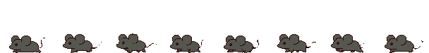 | 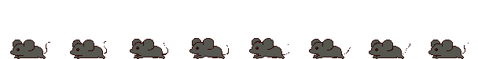 | 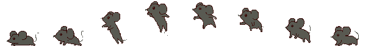 |

| Sleep | Sleep Loop |
|-------|------------|
| 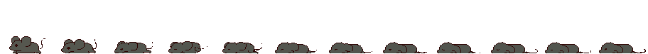 | 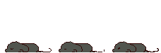 |

### 1-Color

| Walk | Idle | Jump |
|------|------|------|
| 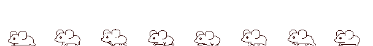 | 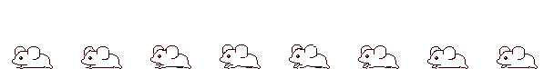 | 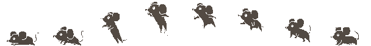 |

| Sleep | Sleep Loop |
|-------|------------|
| 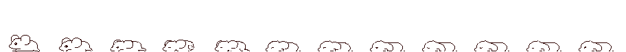 |  |

### Full Color

| Walk | Idle | Jump |
|------|------|------|
| 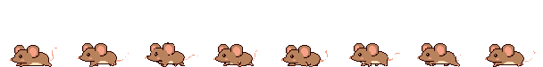 | 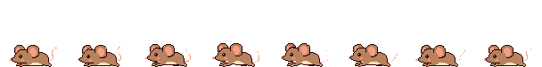 | 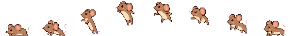 |

| Sleep | Sleep Loop |
|-------|------------|
| 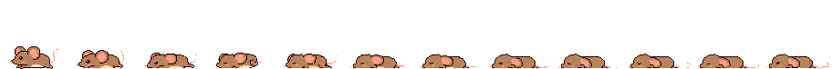 | 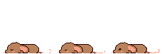 |

---

## Beach Hub

| Background | Player Character |
|------------|-----------------|
| 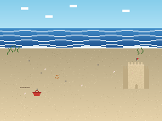 | 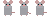 |

---

## Events — 2-Color

| seagull | butterfly | falling_leaf | shooting_star |
|---------|-----------|--------------|---------------|
|  |  |  |  |

| firefly | paper_airplane | balloon | bat |
|---------|----------------|---------|-----|
|  |  |  |  |

| ladybug | dragonfly | jellyfish | dolphin |
|---------|-----------|-----------|---------|
| 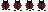 |  | 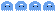 |  |

| hot_air_balloon | comet | dust_devil | frog |
|-----------------|-------|------------|------|
| 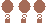 |  |  |  |

| hermit_crab | pelican |
|-------------|---------|
| 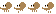 |  |

## Events — 1-Color

| seagull | butterfly | falling_leaf | shooting_star |
|---------|-----------|--------------|---------------|
|  |  |  |  |

| firefly | paper_airplane | balloon | bat |
|---------|----------------|---------|-----|
|  |  |  |  |

| ladybug | dragonfly | jellyfish | dolphin |
|---------|-----------|-----------|---------|
|  |  |  |  |

| hot_air_balloon | comet | dust_devil | frog |
|-----------------|-------|------------|------|
|  |  |  |  |

| hermit_crab | pelican |
|-------------|---------|
|  |  |

---

## Fishing Activity

### Background & Bobber

| Background | Bobber |
|------------|--------|
| 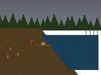 |  |

### Minnows (0–15)

| minnow_00 | minnow_01 | minnow_02 | minnow_03 |
|-----------|-----------|-----------|-----------|
|  |  |  | 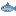 |

| minnow_04 | minnow_05 | minnow_06 | minnow_07 |
|-----------|-----------|-----------|-----------|
|  |  | 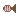 | 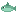 |

| minnow_08 | minnow_09 | minnow_10 | minnow_11 |
|-----------|-----------|-----------|-----------|
|  | 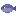 | 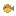 | 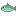 |

| minnow_12 | minnow_13 | minnow_14 | minnow_15 |
|-----------|-----------|-----------|-----------|
| 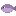 |  | 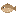 | 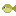 |

### Catchable Items

| seashell | coin | rubber_duck | cork |
|----------|------|-------------|------|
|  |  |  |  |

| driftwood | tin_can | sunglasses | lost_sock |
|-----------|---------|------------|-----------|
|  |  |  |  |

| bottle_cap | beach_ball | message_bottle | sailboat |
|------------|------------|----------------|----------|
|  |  |  |  |

| yacht |
|-------|
|  |

---

## Solitaire Activity

### Card Back (used in game)

### Hearts

| A | 2 | 3 | 4 | 5 | 6 | 7 |
|---|---|---|---|---|---|---|
| 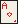 | 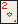 | 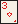 | 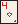 |  | 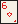 | 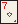 |

| 8 | 9 | 10 | J | Q | K |
|---|---|---|---|---|---|
| 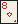 | 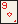 |  |  |  | 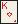 |

### Diamonds

| A | 2 | 3 | 4 | 5 | 6 | 7 |
|---|---|---|---|---|---|---|
| 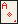 | 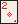 | 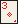 | 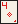 |  | 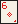 | 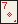 |

| 8 | 9 | 10 | J | Q | K |
|---|---|---|---|---|---|
| 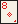 | 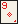 | 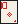 |  | 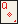 | 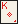 |

### Clubs

| A | 2 | 3 | 4 | 5 | 6 | 7 |
|---|---|---|---|---|---|---|
|  |  |  |  |  |  |  |

| 8 | 9 | 10 | J | Q | K |
|---|---|---|---|---|---|
|  |  |  |  |  |  |

### Spades

| A | 2 | 3 | 4 | 5 | 6 | 7 |
|---|---|---|---|---|---|---|
|  |  |  |  |  |  |  |

| 8 | 9 | 10 | J | Q | K |
|---|---|---|---|---|---|
|  |  |  |  |  |  |

---

## Cooking Activity

### Background

### Ingredients

| cheese | garlic | butter | bread | crumbs |
|--------|--------|--------|-------|--------|
|  |  |  |  |  |

| onion | potato | salt | flour | seeds |
|-------|--------|------|-------|-------|
|  |  |  |  |  |

| honey | egg | carrot | mushroom | celery |
|-------|-----|--------|----------|--------|
|  |  |  |  |  |

### Dishes

| dish_fondue | dish_soup | dish_bread |
|-------------|-----------|------------|
|  |  |  |

### Other

| splat |
|-------|
|  |

---

## Chess Puzzle Activity

### White Pieces

| King | Queen | Rook | Bishop | Knight | Pawn |
|------|-------|------|--------|--------|------|
|  |  |  |  |  |  |

### Black Pieces

| King | Queen | Rook | Bishop | Knight | Pawn |
|------|-------|------|--------|--------|------|
|  |  |  |  |  |  |

---

## Idle Actions (Placeholder Sprite Sheets)

| Grooming (8 frames) | Sniffing (4 frames) |
|----------------------|---------------------|
|  |  |

| Yawning (6 frames) | Looking Around (6 frames) |
|---------------------|---------------------------|
|  |  |

| Tail Wag (4 frames) | Stretching (6 frames) |
|----------------------|-----------------------|
|  |  |

---

## Activities With No Image Files

These activities draw everything with Raylib primitives (no `.png` assets):

- **DanceActivity** — pure drawing
- **PaintActivity** — pixel canvas in memory
- **KiteFlyingActivity** — vector drawing
- **StargazingActivity** — procedural rendering
- **FontPreviewActivity / FontSizeActivity** — text only

---

## Gardening Activity

Currently reuses the beach background:

| Background |
|------------|
|  |
